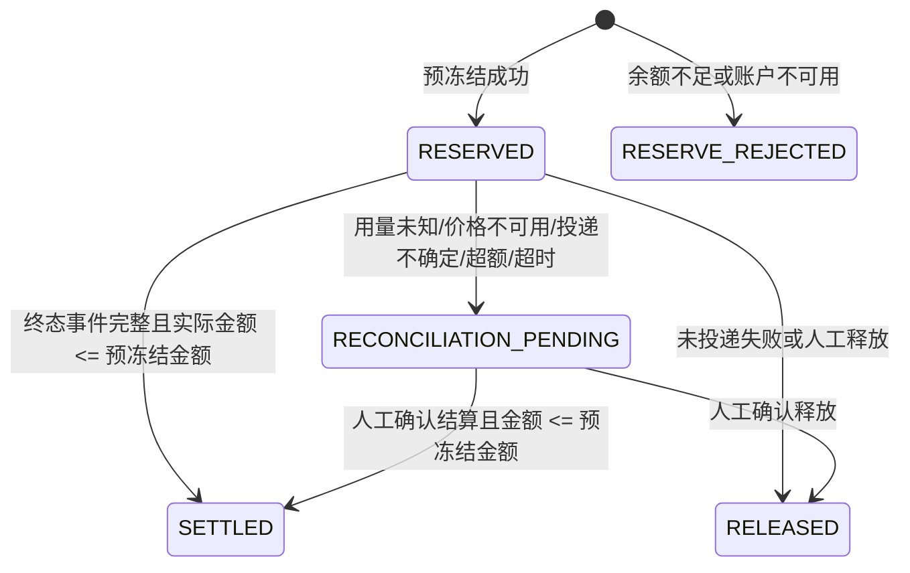

# 余额对账状态机

对账闭环围绕 `billing_reservation.status` 展开。状态迁移只允许由预冻结服务、请求日志消费结算服务、超时扫描器或平台管理员对账接口触发。

## 状态含义

| 状态 | 含义 |
| --- | --- |
| `RESERVED` | 已从可用余额转入冻结余额，Gateway 可以投递上游。 |
| `RESERVE_REJECTED` | 预冻结失败，Gateway 不投递上游。 |
| `SETTLED` | 已从冻结余额扣除最终费用，差额已释放。 |
| `RELEASED` | 未扣费，冻结金额已全部回到可用余额。 |
| `RECONCILIATION_PENDING` | 系统不能安全自动结算，等待平台管理员人工确认。 |

## 人工对账规则

平台管理员在控制台“余额对账”页面处理待对账记录：

- “释放”：将剩余冻结金额全部释放回可用余额，写入 `RELEASE` 流水。
- “结算”：输入最终结算金额，金额必须小于等于预冻结金额；系统扣减该金额并释放差额。
- 若最终金额大于预冻结金额，系统拒绝自动处理，记录继续保留待对账。

对账原因必填，且不得填写 API Key、请求正文、上游响应全文或其他敏感内容。

## DeepSeek 回归建议

真实回归只在本地已安全配置 DeepSeek 上游凭证时执行：

1. 创建或确认租户模型 `modelCode`，例如 `deepseek-chat`。
2. 确认该模型存在 OPENAI 协议路由、可用路由目标、价格和 token 上限。
3. 使用 Fluxora API Key 调用 `GET /v1/models`，确认只返回租户对外模型编码。
4. 使用同一个模型调用 `/v1/chat/completions`。
5. 在请求日志中检查投递状态、token 用量、理论金额、预冻结金额和结算状态。
6. 在额度流水中检查 `RESERVE` 与后续 `SETTLE` / `RELEASE`。

执行时不要打印或提交 DeepSeek API Key、Authorization Header、ProviderCredential 明文/密文或上游完整错误体。
